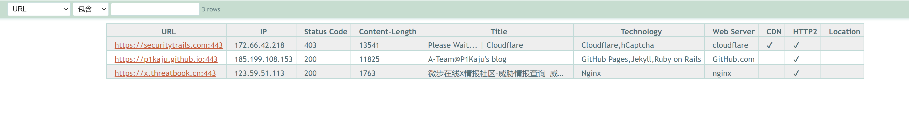

<h1 align="center">
  </a>
  <br>
</h1>


<p align="center">
<a href="https://opensource.org/licenses/MIT"></a>
<a href="https://goreportcard.com/badge/github.com/projectdiscovery/httpx"></a>
<a href="https://github.com/projectdiscovery/httpx/releases"></a>
<a href="https://hub.docker.com/r/projectdiscovery/httpx"></a>
<a href="https://twitter.com/pdiscoveryio"></a>
<a href="https://discord.gg/projectdiscovery"></a>
</p>

<p align="center">
  <a href="#features">特点</a> •
  <a href="#installation-instructions">安装</a> •
  <a href="#usage">使用</a> •
  <a href="#running-httpx">Running httpx</a> •
  <a href="#-notes">Notes</a> •
  <a href="https://discord.gg/projectdiscovery">Join Discord</a>
</p>


httpx is a fast and multi-purpose HTTP toolkit allow to run multiple probers using [retryablehttp](https://github.com/projectdiscovery/retryablehttp-go) library, it is designed to maintain the result reliability with increased threads.

@httpx中文版 @朋于厌
# Features

<h1 align="center">
  </a>
  <br>
</h1>

- 简单和模块化的代码库，使其易于贡献。
- 快速和完全可配置的标志来探测多个元素。
- 支持多种基于HTTP的探测。
- 智能的自动回退，从https到http作为默认。
- 支持主机、URLs和CIDR作为输入。
- 处理边缘情况，如重试、回退等，以处理WAFs。

### Supported probes:-

| Probes          | Default check | Probes            | Default check |
| --------------- | ------------- | ----------------- | ------------- |
| URL             | true          | IP                | true          |
| Title           | true          | CNAME             | true          |
| Status Code     | true          | Raw HTTP          | false         |
| Content Length  | true          | HTTP2             | false         |
| TLS Certificate | true          | HTTP Pipeline     | false         |
| CSP Header      | true          | Virtual host      | false         |
| Line Count      | true          | Word Count        | true          |
| Location Header | true          | CDN               | false         |
| Web Server      | true          | Paths             | false         |
| Web Socket      | true          | Ports             | false         |
| Response Time   | true          | Request Method    | true          |
| Favicon Hash    | false         | Probe  Status     | false         |
| Body Hash       | true          | Header  Hash      | true          |
| Redirect chain  | false         | URL Scheme        | true          |
| JARM Hash       | false         | ASN               | false         |

# Installation Instructions

httpx requires **go1.17** to install successfully. Run the following command to get the repo - 

```sh
go install -v github.com/P1kAju/httpx/cmd/httpx@latest
```

```sh
▶ git clone https://github.com/P1kAju/httpx.git;cd httpx;go mod tidy;cd cmd/httpx; go build; mv httpx /usr/local/bin/; httpx -version
```

# Usage

```sh
httpx -h
```

This will display help for the tool. Here are all the switches it supports.


```console
httpx是一个快速和多用途的HTTP工具包，允许使用retryablehttp库运行多个探测器.

Usage:
  C:\Users\ancient\Documents\code\httpx\cmd\httpx\httpx.exe [flags]

Flags:
INPUT:
   -l, -list string      待处理的目标列表文件
   -rr, -request string  原始请求文件

PROBES 获取 & 输出:
   -sc, -status-code     响应-状态代码
   -cl, -content-length  响应-内容长度
   -ct, -content-type    响应-内容类型
   -location             响应重定向位置
   -favicon              '/favicon.ico' 文件的mmh3哈希值
   -hash string          哈希值（支持：MD5,MMH3,SIMHash,SHA1,SHA256,SHA512）。
   -jarm                 jarm指纹哈希值
   -rt, -response-time   响应时间
   -lc, -line-count      响应正文行数
   -wc, -word-count      响应body字数
   -title                页面标题
   -server, -web-server  display server
   -td, -tech-detect     基于Wappalyzer获取指纹
   -method               http请求方法
   -websocket            利用websocket获取服务
   -ip                   display host ip
   -cname                display host cname
   -asn                  display host asn information
   -cdn                  display cdn in use
   -probe                显示探头状态

MATCHERS:
   -mc, -match-code string         匹配具有指定状态代码的响应 (-mc 200,302)
   -ml, -match-length string       匹配指定内容长度的响应 (-ml 100,102)
   -mlc, -match-line-count string  匹配指定行数的响应 (-mlc 423,532)
   -mwc, -match-word-count string  匹配指定字数的响应 (-mwc 43,55)
   -mfc, -match-favicon string[]   匹配指定的favicon哈希值响应 (-mfc 1494302000)
   -ms, -match-string string       用指定的字符串匹配响应 (-ms admin)
   -mr, -match-regex string        用正则匹配响应 (-mr admin)

EXTRACTOR:
   -er, -extract-regex string  显示指定的regex的响应内容

FILTERS:
   -fc, -filter-code string         过滤指定状态代码的响应 (-fc 403,401)
   -fl, -filter-length string       过滤指定内容长度的响应 (-fl 23,33)
   -flc, -filter-line-count string  过滤指定行数的响应 (-flc 423,532)
   -fwc, -filter-word-count string  过滤指定字数的响应 (-fwc 423,532)
   -ffc, -filter-favicon string[]   过滤指定的favicon哈希值响应 (-mfc 1494302000)
   -fs, -filter-string string       用指定的字符串来过滤响应 (-fs admin)
   -fe, -filter-regex string        用指定的正则过滤响应 (-fe admin)

RATE-LIMIT:
   -t, -threads int              线程数 (default 50)
   -rl, -rate-limit int          每秒可发送的最大请求 (default 150)
   -rlm, -rate-limit-minute int  每分钟发送的最大请求数

MISCELLANEOUS:
   -pa, -probe-all-ips  探测与同一主机相关的所有ips
   -p, -ports string[]  探测端口 (nmap syntax: eg 1,2-10,11)
   -path string         探测的路径或路径列表 (comma-separated, file)
   -tls-probe           send http probes on the extracted TLS domains (dns_name)
   -csp-probe           send http probes on the extracted CSP domains
   -tls-grab            perform TLS(SSL) data grabbing
   -pipeline            探测和显示 server supporting HTTP1.1 pipeline
   -http2               探测和显示 server supporting HTTP2
   -vhost               探测和显示 server supporting VHOST

OUTPUT:
   -o, -output string                输出结果(必要的)
   -sr, -store-response              http响应包到输出目录
   -srd, -store-response-dir string  http响应包到自定义目录
   -html                             以html格式存储输出
   -csv                              以csv格式存储输出
   -json                             以JSONL(ines)格式存储输出。
   -irr, -include-response           输出http请求/响应的内容到JSON文件 (-json only)
   -include-chain                    输出请求重定向内容到JSON文件 (-json only)
   -store-chain                      输出请求重定向内容到文件 (-sr only)

CONFIGURATIONS:
   -r, -resolvers string[]       自定义解析器列表 (file or comma separated)
   -allow string[]               允许处理的IP/URl的列表 (file or comma separated)
   -deny string[]                禁止处理的IP/URl的列表 (file or comma separated)
   -random-agent                 启用随机user-agent (默认开启) (default true)
   -H, -header string[]          自定义请求头 (-H Cookie:k=v)
   -http-proxy, -proxy string    http proxy to use (eg http://127.0.0.1:8080)
   -unsafe                       发送原始请求，跳过golang的规范化处理
   -resume                       使用 resume.cfg 恢复扫描
   -fr, -follow-redirects        遵循http重定向
   -maxr, -max-redirects int     最大重定向数 (default 10)
   -fhr, -follow-host-redirects  跟随host重定向
   -vhost-input                  get a list of vhosts as input
   -x string                     使用所有的HTTP方法探测
   -body string                  http请求正文
   -s, -stream                   顺序探测模式
   -sd, -skip-dedupe             禁用重复计算的输入项目 (only used with stream mode)
   -ldp, -leave-default-ports    header保留默认http/https端口 (eg. http://host:80 - https//host:443

DEBUG:
   -debug                    在终端中显示请求/响应的内容
   -debug-req                在终端中显示请求内容
   -debug-resp               在终端中显示响应内容
   -version                  显示 httpx 版本
   -stats                    显示扫描统计信息
   -silent                   静默模式
   -v, -verbose              详细模式
   -si, -stats-interval int  显示统计资料更新之间的等待秒数 (default: 5)
   -nc, -no-color            禁用终端输出颜色

OPTIMIZATIONS & 优化:
   -nf, -no-fallback                  侦察http/https协议 (HTTPS and HTTP)
   -nfs, -no-fallback-scheme          指定协议方法进行侦察
   -maxhr, -max-host-error int        在跳过剩余路径之前，每个主机的最大错误数 (default 30)
   -ec, -exclude-cdn                  跳过CDN端口扫描 (only checks for 80,443)
   -retries int                       重试次数 (-retries 2)
   -timeout int                       超时, 以秒为单位 (default: 5  -timeout 10) (default 5)
   -rsts, -response-size-to-save int  保存的最大响应大小 (字节) (default 2147483647)
   -rstr, -response-size-to-read int  读取的最大响应大小 (字节) (default 2147483647)
```

# Running httpX

### 输出到html文件
将httpx处理结果以html文件形式展示。
```console
./httpx -l .\1.txt -o 1.html -html -location  -td -title -status-code -probe  -cdn  -http2


    __    __  __       _  __
   / /_  / /_/ /_____ | |/ /
  / __ \/ __/ __/ __ \|   /
 / / / / /_/ /_/ /_/ /   |
/_/ /_/\__/\__/ .___/_/|_|
             /_/              v1.2.1

                projectdiscovery.io

Use with caution. You are responsible for your actions.
Developers assume no liability and are not responsible for any misuse or damage.
https://securitytrails.com [SUCCESS] [403] [] [Please Wait... | Cloudflare] [http2] [cloudflare] [Cloudflare,hCaptcha]
https://p1kaju.github.io [SUCCESS] [200] [] [A-Team@P1Kaju's blog] [http2] [GitHub Pages,Jekyll,Ruby on Rails]
https://x.threatbook.cn [SUCCESS] [200] [] [微步在线X情报社区-威胁情报查询_威胁分析平台_开放社区] [pipeline] [http2] [Nginx]
```


[HTML输出DEMO](https://output.jsbin.com/rarukojopa)

- 表格自动排序
- 内容过滤器


### URL Probe

This will run the tool against all the hosts and subdomains in `hosts.txt` and returns URLs running HTTP webserver. 

```console
cat hosts.txt | httpx 

    __    __  __       _  __
   / /_  / /_/ /_____ | |/ /
  / __ \/ __/ __/ __ \|   / 
 / / / / /_/ /_/ /_/ /   |  
/_/ /_/\__/\__/ .___/_/|_|   v1.1.1  
             /_/            

    projectdiscovery.io

[WRN] Use with caution. You are responsible for your actions
[WRN] Developers assume no liability and are not responsible for any misuse or damage.

https://mta-sts.managed.hackerone.com
https://mta-sts.hackerone.com
https://mta-sts.forwarding.hackerone.com
https://docs.hackerone.com
https://www.hackerone.com
https://resources.hackerone.com
https://api.hackerone.com
https://support.hackerone.com
```

### File Input

This will run the tool with the `probe` flag against all of the hosts in **hosts.txt** and return URLs with probed status.

```console
httpx -list hosts.txt -silent -probe

http://ns.hackerone.com [FAILED]
https://docs.hackerone.com [SUCCESS]
https://mta-sts.hackerone.com [SUCCESS]
https://mta-sts.managed.hackerone.com [SUCCESS]
http://email.hackerone.com [FAILED]
https://mta-sts.forwarding.hackerone.com [SUCCESS]
http://links.hackerone.com [FAILED]
https://api.hackerone.com [SUCCESS]
https://www.hackerone.com [SUCCESS]
http://events.hackerone.com [FAILED]
https://support.hackerone.com [SUCCESS]
https://gslink.hackerone.com [SUCCESS]
http://o1.email.hackerone.com [FAILED]
http://info.hackerone.com [FAILED]
https://resources.hackerone.com [SUCCESS]
http://o2.email.hackerone.com [FAILED]
http://o3.email.hackerone.com [FAILED]
http://go.hackerone.com [FAILED]
http://a.ns.hackerone.com [FAILED]
http://b.ns.hackerone.com [FAILED]
```

### CIDR Input   

```console
echo 173.0.84.0/24 | httpx -silent

https://173.0.84.29
https://173.0.84.43
https://173.0.84.31
https://173.0.84.44
https://173.0.84.12
https://173.0.84.4
https://173.0.84.36
https://173.0.84.45
https://173.0.84.14
https://173.0.84.25
https://173.0.84.46
https://173.0.84.24
https://173.0.84.32
https://173.0.84.9
https://173.0.84.13
https://173.0.84.6
https://173.0.84.16
https://173.0.84.34
```


### Tool Chain


```console
subfinder -d hackerone.com -silent| httpx -title -tech-detect -status-code

    __    __  __       _  __
   / /_  / /_/ /_____ | |/ /
  / __ \/ __/ __/ __ \|   /
 / / / / /_/ /_/ /_/ /   |
/_/ /_/\__/\__/ .___/_/|_|
             /_/              v1.1.1

    projectdiscovery.io

Use with caution. You are responsible for your actions
Developers assume no liability and are not responsible for any misuse or damage.
https://mta-sts.managed.hackerone.com [404] [Page not found · GitHub Pages] [Varnish,GitHub Pages,Ruby on Rails]
https://mta-sts.hackerone.com [404] [Page not found · GitHub Pages] [Varnish,GitHub Pages,Ruby on Rails]
https://mta-sts.forwarding.hackerone.com [404] [Page not found · GitHub Pages] [GitHub Pages,Ruby on Rails,Varnish]
https://docs.hackerone.com [200] [HackerOne Platform Documentation] [Ruby on Rails,jsDelivr,Gatsby,React,webpack,Varnish,GitHub Pages]
https://support.hackerone.com [301,302,301,200] [HackerOne] [Cloudflare,Ruby on Rails,Ruby]
https://resources.hackerone.com [301,301,404] [Sorry, no Folders found.]
```

### Favicon Hash


```console
subfinder -d hackerone.com -silent | httpx -favicon

    __    __  __       _  __
   / /_  / /_/ /_____ | |/ /
  / __ \/ __/ __/ __ \|   /
 / / / / /_/ /_/ /_/ /   |
/_/ /_/\__/\__/ .___/_/|_|
             /_/              v1.1.5

      projectdiscovery.io

Use with caution. You are responsible for your actions.
Developers assume no liability and are not responsible for any misuse or damage.
https://docs.hackerone.com/favicon.ico [595148549]
https://hackerone.com/favicon.ico [595148549]
https://mta-sts.managed.hackerone.com/favicon.ico [-1700323260]
https://mta-sts.forwarding.hackerone.com/favicon.ico [-1700323260]
https://support.hackerone.com/favicon.ico [-1279294674]
https://gslink.hackerone.com/favicon.ico [1506877856]
https://resources.hackerone.com/favicon.ico [-1840324437]
https://api.hackerone.com/favicon.ico [566218143]
https://mta-sts.hackerone.com/favicon.ico [-1700323260]
https://www.hackerone.com/favicon.ico [778073381]
```

### [JARM Fingerprint](https://github.com/salesforce/jarm)


```console
subfinder -d hackerone.com -silent | httpx -jarm
    __    __  __       _  __
   / /_  / /_/ /_____ | |/ /
  / __ \/ __/ __/ __ \|   /
 / / / / /_/ /_/ /_/ /   |
/_/ /_/\__/\__/ .___/_/|_|
             /_/              v1.2.1

      projectdiscovery.io

Use with caution. You are responsible for your actions.
Developers assume no liability and are not responsible for any misuse or damage.
https://www.hackerone.com [29d3dd00029d29d00042d43d00041d5de67cc9954cc85372523050f20b5007]
https://mta-sts.hackerone.com [29d29d00029d29d00042d43d00041d2aa5ce6a70de7ba95aef77a77b00a0af]
https://mta-sts.managed.hackerone.com [29d29d00029d29d00042d43d00041d2aa5ce6a70de7ba95aef77a77b00a0af]
https://docs.hackerone.com [29d29d00029d29d00042d43d00041d2aa5ce6a70de7ba95aef77a77b00a0af]
https://support.hackerone.com [29d3dd00029d29d00029d3dd29d29d5a74e95248e58a6162e37847a24849f7]
https://api.hackerone.com [29d3dd00029d29d00042d43d00041d5de67cc9954cc85372523050f20b5007]
https://mta-sts.forwarding.hackerone.com [29d29d00029d29d00042d43d00041d2aa5ce6a70de7ba95aef77a77b00a0af]
https://resources.hackerone.com [2ad2ad0002ad2ad0002ad2ad2ad2ad043bfbd87c13813505a1b60adf4f6ff5]
```

### ASN Fingerprint


```console
subfinder -d hackerone.com -silent | httpx -asn
    __    __  __       _  __
   / /_  / /_/ /_____ | |/ /
  / __ \/ __/ __/ __ \|   /
 / / / / /_/ /_/ /_/ /   |
/_/ /_/\__/\__/ .___/_/|_|
             /_/              v1.2.1

      projectdiscovery.io

Use with caution. You are responsible for your actions.
Developers assume no liability and are not responsible for any misuse or damage.
https://mta-sts.managed.hackerone.com [AS54113, FASTLY, US, 185.199.108.0/24]
https://gslink.hackerone.com [AS16509, AMAZON-02, US, 13.33.168.0/22]
https://www.hackerone.com [AS13335, CLOUDFLARENET, US, 104.16.96.0/20]
https://mta-sts.forwarding.hackerone.com [AS54113, FASTLY, US, 185.199.108.0/24]
https://resources.hackerone.com [AS16509, AMAZON-02, US, 3.98.0.0/15]
https://support.hackerone.com [AS13335, CLOUDFLARENET, US, 104.16.48.0/20]
https://mta-sts.hackerone.com [AS54113, FASTLY, US, 185.199.111.0/24]
https://docs.hackerone.com [AS54113, FASTLY, US, 185.199.109.0/24]
https://api.hackerone.com [AS13335, CLOUDFLARENET, US, 104.16.96.0/20]
```


### Path Probe


```console
httpx -l urls.txt -path /v1/api -sc

    __    __  __       _  __
   / /_  / /_/ /_____ | |/ /
  / __ \/ __/ __/ __ \|   /
 / / / / /_/ /_/ /_/ /   |
/_/ /_/\__/\__/ .___/_/|_|
             /_/              v1.1.5

      projectdiscovery.io

Use with caution. You are responsible for your actions.
Developers assume no liability and are not responsible for any misuse or damage.
https://mta-sts.managed.hackerone.com/v1/api [404]
https://mta-sts.hackerone.com/v1/api [404]
https://mta-sts.forwarding.hackerone.com/v1/api [404]
https://docs.hackerone.com/v1/api [404]
https://api.hackerone.com/v1/api [401]
https://hackerone.com/v1/api [302]
https://support.hackerone.com/v1/api [404]
https://resources.hackerone.com/v1/api [301]
https://gslink.hackerone.com/v1/api [404]
http://www.hackerone.com/v1/api [301]
```

### Docker Run

```console
cat sub_domains.txt | docker run -i projectdiscovery/httpx

    __    __  __       _  __
   / /_  / /_/ /_____ | |/ /
  / __ \/ __/ __/ __ \|   /
 / / / / /_/ /_/ /_/ /   |
/_/ /_/\__/\__/ .___/_/|_|
             /_/              v1.1.2

      projectdiscovery.io

Use with caution. You are responsible for your actions
Developers assume no liability and are not responsible for any misuse or damage.
https://mta-sts.forwarding.hackerone.com
https://mta-sts.hackerone.com
https://mta-sts.managed.hackerone.com
https://www.hackerone.com
https://api.hackerone.com
https://gslink.hackerone.com
https://resources.hackerone.com
https://docs.hackerone.com
https://support.hackerone.com
```


# 📋 Notes

- As default, **httpx** checks for `HTTPS` probe and fall-back to `HTTP` only if `HTTPS` is not reachable.
- For printing both HTTP/HTTPS results, `no-fallback` flag can be used.
- Custom scheme for ports can be defined, for example `-ports http:443,http:80,https:8443`
- `favicon`,`vhost`, `http2`, `pipeline`, `ports`, `csp-probe`, `tls-probe` and `path` are unique flag with different probes.
- Unique flags should be used for specific use cases instead of running them as default with other probes.
- When using `json` flag, all the information (default probes) included in the JSON output.
- Custom resolver supports multiple protocol (**doh|tcp|udp**) in form of `protocol:resolver:port`  (eg **udp:127.0.0.1:53**)
- Invalid custom resolvers/files are ignored.

# Acknowledgement

httpx is made with 🖤 by the [projectdiscovery](https://projectdiscovery.io) team. Community contributions have made the project what it is. See the **[Thanks.md](https://github.com/projectdiscovery/httpx/blob/master/THANKS.md)** file for more details. Do also check out these similar awesome projects that may fit in your workflow:

Probing feature is inspired by [@tomnomnom/httprobe](https://github.com/tomnomnom/httprobe) work :heart:
